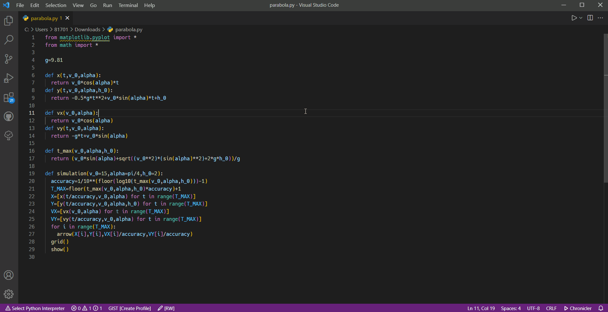

# VSCode Numworks Simulator

This extension makes it possible to simulate numworks calculator in vscode.

## Feature

 - Run Numworks simulator (full or python).
 - Reload simulator automatically when changes in the script are detected.

## Usage

### Full Simulator

Execute `Numworks Simulator: Run Simulator`.

Note: This command doesn't load any script.

### Python Simulator

 1. Open python file.
 2. Execute `Numworks Simulator: Run Python Simulator` or `Numworks Simulator: Run Python Simulator at the Side` or click run button in editor title menu.

Note: Now, simulator loads only one opened script. If you import except standard library in it, it won't work well.
